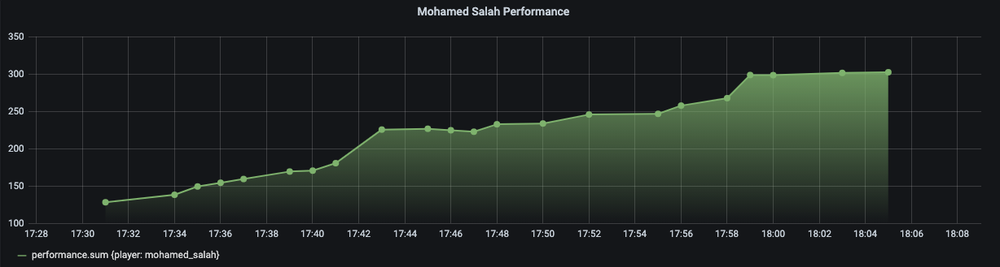
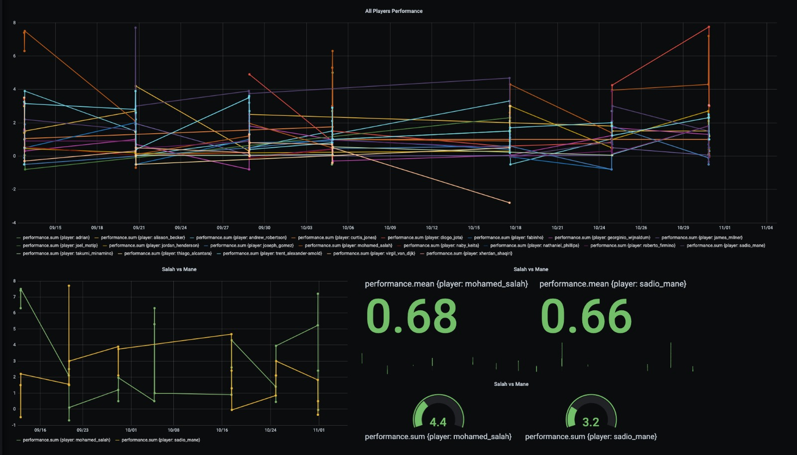

# StockBall 

Every football player in Premier League in a trading system. 😃 ⚽ 🏴󠁧󠁢󠁥󠁮󠁧󠁿

This is a lab experiment to be able to process real-time data from every match in Premier League and score every player performance given certain pre-defined rules.
For the sake of funny the code was written quickly without thousands validation.

This project also includes a docker environment with InfluxDB and Grafana to allow visualize the data point and play around with some queries. 

## Local Development

### How to run Docker dependencies
- `make docker.run.dependencies`: InfluxDB + Grafana

### How to load data source (fixture + match events)
- `make load.data SOURCE-PATH=/output SOURCE-URL=https://some-source/premier-league FIXTURE-PATH=/the/path/for/fixture/source/file`

### Visualization
- You can play around testing some queries. In [`/docker/grafana/dashboard`](./docker/grafana/dashboards) is included a demo (and preliminary) example.
Go to [`http://localhost:3000`](http://localhost:3000) (admin/admin)

 

###### Salah performance by minute in Game 8 (Manchester City VS Liverpool) on 2020-11-08.

 

###### Salah VS Mane performance.